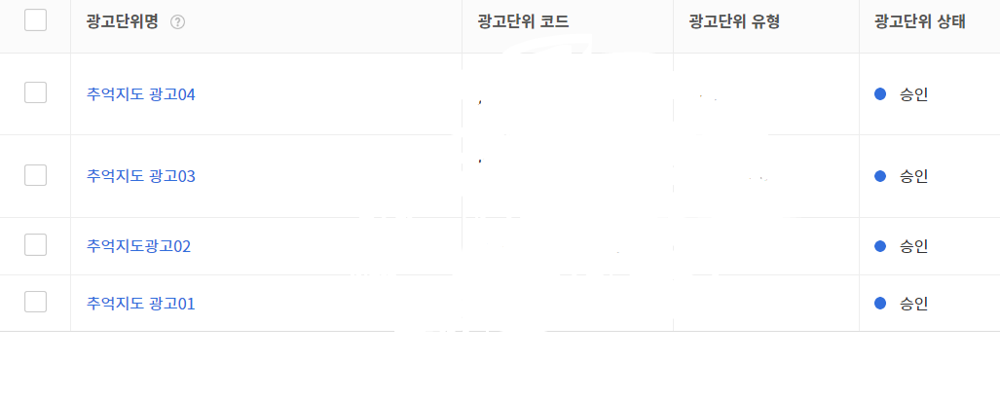
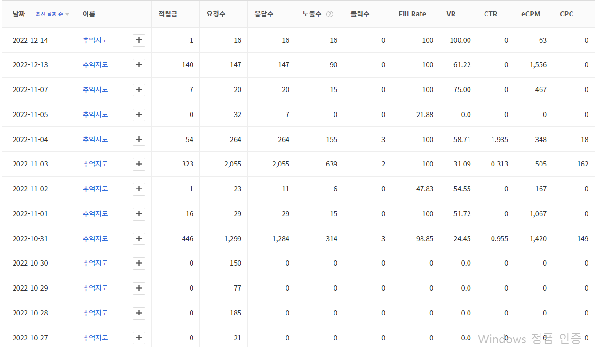

# 소개

추억지도 프론트 입니다.

추억지도는 한 해를 기억하며 다양한 추억을 기록해 친구들과 공유하며 자랑 할 수 있습니다
참여율을 높이기위해 유저별 지도가 있으며 모든 추억을 볼수있는 지도도 있습니다.

## 기술 설명

추억지도 서버는 아래의 핵심 기술을 사용하여 만들어졌습니다.
자세한 패키지는 `package.json`을 확인해주시면 감사하겠습니다.

- React.js
  - kakao-maps-sdk
  - daum-postcode

## Devops 설정

추억지도 프론트는 `Docker`에 띄워지게 설계되어져 있습니다.
`build`폴더를 mount하여 Nginx에 띄워 사용합니다.
자세한 설정은 [해당 git](https://github.com/tjrehdrms123/mp-cloudserver)을 참고하여 주시면 감사하겠습니다.

## Adfit 인증

## 프로젝트 리뷰

배운점

   
  <ul>
    <li>지도에 사용자가 작성한 글을 띄워주는 작업을 하면서, 카카오 맵 API, 다음 Postcode를 이용해 활용하는 법을 배웠다.</li>
    <li>API를 호출할때 Bearer을 셋팅하는 방법을 배웠다. </li>
    <li>adfit(광고)을 적용하면서 수익화 하는 법에 대한 개념을 익혔다</li>
  </ul>

